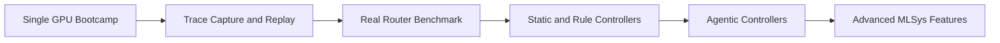
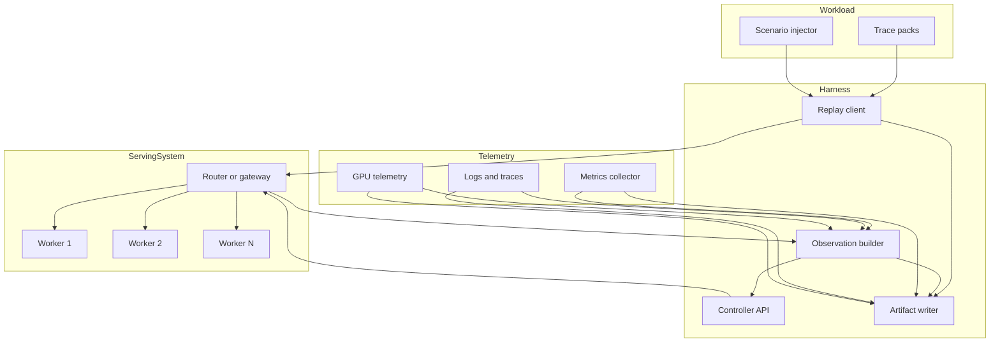
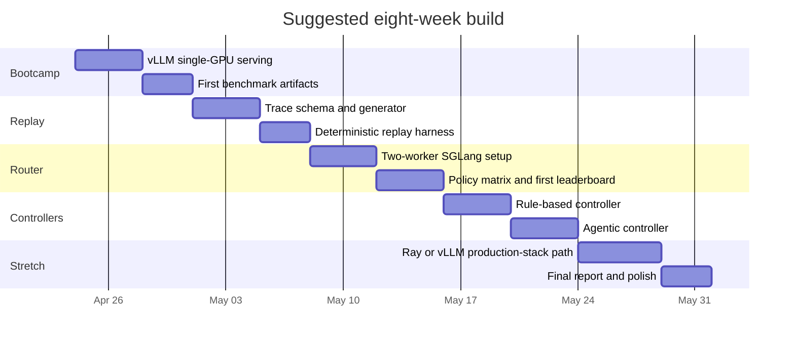

# From GPU Serving Bootcamp to ServingOps Control Bench

## Executive summary

The highest-value project for your goals is a new repo that begins as a **real GPU-serving bootcamp** and becomes a **policy-centric benchmark for LLM serving routers**. The shortest path to something impressive in two to eight weeks is not another pure simulator. It is a benchmark harness that talks to **real serving backends** through API endpoints, measures real latency and cache behavior, and then compares **static, rule-based, and agentic controllers** on top of those backends. Official docs already show that modern open serving stacks expose the primitives you care about: vLLM gives you a straightforward OpenAI-compatible serving path plus a built-in serving benchmark CLI; SGLang gives you a router/gateway with cache-aware routing, PD routing, rate limiting, circuit breakers, Prometheus metrics, and tracing; entity["organization","Ray","distributed computing project"] Serve LLM adds distributed orchestration, custom routing, autoscaling, and TTFT/TPOT-focused observability; and entity["company","NVIDIA","gpu company"] Dynamo pushes further into system-level optimization with disaggregation, KV-aware routing, modular adoption, and AIConfigurator. citeturn5view1turn20view1turn23view2turn17view0turn30view0turn17view1turn9view3

The strongest differentiator is to make the **router/controller** the real system under test. Recent work from entity["organization","MLCommons","benchmark consortium"] is moving toward API-native, reproducible endpoint benchmarking with TTFT, TPOT, throughput, interactivity, Pareto curves, and detailed run reports. That is important context: the industry is already converging on endpoint-centric measurement. Your opening is to build the layer that those official materials do not make the primary benchmark object: **operational decision quality under pressure**. In other words, not just “how fast is the engine,” but “did the policy make the right routing, batching, cache, and failover choices for this workload?” citeturn28view0turn28view1turn5view11

The recommended progression is simple. **Milestone 0** should be vLLM on a single cheap GPU with real measurements and benchmark artifacts. **Milestone 1** should record and replay traces. **Milestone 2** should put a real router in front of two small workers, with SGLang Model Gateway as the first serious target. **Milestone 3** should add controllers and agents. **Milestone 4** should be optional advanced MLSys work: Ray Serve, vLLM Production Stack on Kubernetes, shared KV, or Dynamo disaggregation. That sequence maximizes learning, minimizes cost risk, and produces a repo that looks like infrastructure, not a hackathon demo. citeturn15view2turn26view0turn23view0turn9view5turn17view1

The rest of this report assumes a few unspecified details. I assume Linux x86-64 hosts, one rented GPU at a time for the first phase, a weak local GPU that is useful mainly for development but not serious benchmarking, a preference for cheap cloud credits over a persistent cluster, and a new repo rather than extending an existing benchmark repo. Those are design assumptions, not sourced facts.

| Decision | Recommendation |
|---|---|
| Core repo | `servingops-control-bench` |
| First engine | vLLM |
| First real router | SGLang Model Gateway |
| Stretch backend | Ray Serve LLM |
| Stretch MLSys system | Dynamo |
| Cheapest practical clouds | Modal T4/L4 for bursty experiments; Lambda Quadro/A6000/A10 for longer runs; Hugging Face ZeroGPU for demo artifacts only |
| Best wow-factor artifact | A reproducible leaderboard showing which policy wins under cache, latency, load, and failure pressure |

## Why this project matters

Official serving stacks have gotten much better at the **serving plane** itself. vLLM exposes an OpenAI-compatible server and now has a production stack with KV-cache-aware routing, prefix-aware routing, disaggregated prefill, shared KV cache tutorials, tracing, and autoscaling-oriented deployment docs. SGLang positions itself as production serving, and its gateway surfaces load-balancing policies, PD disaggregation, reliability controls, observability, and OpenAI-compatible interfaces. Ray Serve LLM explicitly documents distributed patterns such as prefill/decode disaggregation, data parallel attention, multi-node deployments, custom routing, and dashboard-oriented observability. Dynamo’s own docs describe the system in terms of a fast request path, a responsive control path, and a resilient state path for KV reuse and failure recovery. citeturn9view5turn9view4turn18search0turn23view2turn17view0turn30view0turn9view3

What is still underbuilt, in the sources reviewed here, is a **neutral benchmark harness for control policies across these routers and serving topologies**. MLPerf Endpoints is explicitly API-centric and captures TTFT, throughput, interactivity, and query latency over a system’s operating range, which is the right benchmark direction. But that still evaluates the endpoint as a whole. Your project can push one level deeper and score things like **route selection, cache-locality exploitation, traffic deferral, worker draining, escalation under failures, and prefill/decode mode changes**. That is the missing layer that matches your background in scheduler-style infrastructure benchmarks and your desire to learn practical serving. citeturn28view1turn28view0



The progression above is proposed, but it is grounded in the shape of the official ecosystem: API-first serving, cache-aware routing, PD disaggregation, and observability are already exposed by the backends you want to learn. That is why a benchmark harness can become the unifying project rather than a side experiment. citeturn15view2turn23view2turn23view0turn17view1

A useful way to describe the project in one sentence is this:

> **A benchmark harness for evaluating serving control policies on real LLM routers under cache, latency, load, and failure pressure.**

That statement is a project thesis rather than a sourced claim, but it fits the current serving stack landscape and is much more portfolio-visible than “I built a simulator.”

## Recommended system architecture

The benchmark should be **API-first and backend-agnostic**. That is the right architecture for two reasons. First, MLPerf Endpoints explicitly argues for a decoupled client/server design where the system under test is simply a URL. Second, vLLM, SGLang, and Ray Serve LLM all expose or front OpenAI-compatible entrypoints, which means your harness can normalize how it sends traffic and collects results. citeturn28view0turn28view1turn5view1turn23view3turn23view0



A clean repo layout should separate **traffic generation**, **backend adapters**, **controller policies**, **metrics/artifacts**, and **analysis**. That keeps the project credible and makes later backend swaps easy.

| Path | Purpose |
|---|---|
| `backends/` | Adapters for vLLM, SGLang router, Ray Serve, Dynamo |
| `traces/` | Scenario packs in JSONL or Parquet |
| `replay/` | Load generation, trace replay, failure injection |
| `controllers/` | Static, rule-based, and agentic policies |
| `metrics/` | Parsers for TTFT, TPOT, tokens/sec, GPU metrics, cost |
| `artifacts/` | Saved JSON, Parquet, plots, leaderboards, reports |
| `analysis/` | Calibration notebooks and policy comparisons |
| `deploy/` | Backend startup scripts and config templates |
| `docs/` | Architecture, benchmark spec, leaderboard format |
| `scripts/` | Repeatable shell entrypoints for common runs |

The architecture should also support a **real-run to simulator calibration loop**, because you do still want simulator leverage without making the simulator the whole project. The practical version of that loop is: run real workloads, log per-request features and outcomes, fit simple latency/cost/cache models, use the simulator to cheaply search policies offline, and then re-run only the best candidates on real backends. That is the right compromise between realism and cost.

## Phased roadmap

The roadmap below is organized exactly around the project evolution you asked for: **Milestone 0 GPU bootcamp → Milestone 1 trace replay → Milestone 2 real-router benchmark → Milestone 3 controllers/agents → Milestone 4 advanced MLSys features**.

| Phase | Main goal | Minimal infra | Expected spend | Primary artifact |
|---|---|---|---|---|
| Milestone 0 | Serve one model on one GPU and measure it | 1 cheap GPU | roughly \$2–\$7 dedicated spend if you pay directly, less with credits | benchmark JSON, GPU telemetry CSV, first plots |
| Milestone 1 | Reproduce workloads with trace replay | same 1 GPU | roughly \$3–\$10 | deterministic trace pack + replay harness |
| Milestone 2 | Put a real router in front of real workers | 1 larger GPU or 2 small GPUs | roughly \$7–\$25 | router benchmark matrix and first leaderboard |
| Milestone 3 | Compare static, rule-based, and agentic policies | same as Milestone 2 | roughly \$5–\$20 incremental | controller scoreboard and failure analysis |
| Milestone 4 | Add advanced MLSys features | optional cluster or K8s | highly variable, often \$20–\$100+ | stretch report on PD, shared KV, autoscaling, or Dynamo |

These ranges are planning estimates derived from the official price sheets reviewed later in this report and assume short experimental windows, not 24/7 runtime. They exclude taxes, storage, CPU/memory extras on serverless platforms, and any regional multipliers. citeturn21view1turn21view2turn29view0turn24view2

### GPU bootcamp

**Milestone 0** is where you learn the mechanics of actual serving on a GPU and produce your first benchmark artifacts. The deliverable is not “the model answered a prompt.” The deliverable is: **you can start a server, hit it with reproducible traffic, measure TTFT/TPOT/throughput, and save the run in a format you can compare later**.

The best starter model family is Qwen from entity["company","Alibaba Cloud","cloud provider"] because the small instruct variants are openly accessible on the Hugging Face Hub under Apache-2.0 and have manageable sizes. The Qwen2.5-0.5B-Instruct card lists 0.49B parameters and a 32,768-token context; the 1.5B-Instruct card lists 1.54B parameters and the same 32,768-token context. Llama 3.2 from entity["company","Meta","technology company"] is also a good portfolio model family, with 1B and 3B instruct variants and a 128k context in the model card, but it comes with license-acceptance friction and a custom community license, so it is better as a second-stage comparison target rather than the first bootcamp model. citeturn16view0turn16view1turn16view2turn16view3

The most direct bootcamp path is vLLM. Its quickstart documents Linux and Python 3.10–3.13 as prerequisites, uses `uv` for installation, exposes a `vllm serve` command, and can be benchmarked with `vllm bench serve`, including TTFT/TPOT percentiles and detailed result saving. citeturn15view3turn5view1turn20view0turn20view1

**Concrete deliverables**

| Deliverable | What “done” means |
|---|---|
| One real serving endpoint | `/v1/models` and `/v1/chat/completions` respond successfully |
| One load script | Reproducible traffic with fixed input/output lengths and request rate |
| One telemetry capture | `nvidia-smi` log plus benchmark JSON |
| One baseline report | p50/p95/p99 TTFT, TPOT, throughput, and GPU utilization plot |
| One README section | exact commands, hardware SKU, cloud cost, and resulting charts |

**Reproducible commands for Milestone 0**

```bash
# Assumptions:
# - Linux host
# - NVIDIA driver already installed
# - Python 3.12 available
# - One GPU attached

uv venv --python 3.12 --seed
source .venv/bin/activate
uv pip install vllm --torch-backend=auto openai pandas psutil pynvml

mkdir -p logs results/m0

# Launch a small, low-friction open model
nohup vllm serve Qwen/Qwen2.5-1.5B-Instruct \
  --host 0.0.0.0 \
  --port 8000 \
  --dtype auto \
  --api-key local-dev > logs/vllm.log 2>&1 &

# Sanity check
curl http://127.0.0.1:8000/v1/models \
  -H "Authorization: Bearer local-dev"

# Start 1-second GPU telemetry
nvidia-smi \
  --query-gpu=timestamp,name,utilization.gpu,utilization.memory,memory.used,memory.total,power.draw \
  --format=csv -l 1 > results/m0/nvidia_smi.csv &
export GPU_LOG_PID=$!

# Run a deterministic serving benchmark
vllm bench serve \
  --backend openai \
  --base-url http://127.0.0.1:8000 \
  --model Qwen/Qwen2.5-1.5B-Instruct \
  --dataset-name random \
  --input-len 512 \
  --output-len 128 \
  --request-rate 2 \
  --num-prompts 100 \
  --disable-shuffle \
  --save-result \
  --save-detailed \
  --result-dir results/m0 \
  --percentile-metrics ttft,tpot,itl \
  --metric-percentiles 50,95,99

kill $GPU_LOG_PID
```

Those commands are adapted from the official vLLM installation, serving, and benchmarking docs. The benchmark CLI officially supports request rate, concurrency, dataset choice, result saving, TTFT/TPOT percentile reporting, and detailed per-request outputs. citeturn15view0turn15view2turn20view0turn20view1

If you want a second Milestone 0 path to compare serving engines early, SGLang also has a straightforward install-and-serve route:

```bash
source .venv/bin/activate
uv pip install sglang

python3 -m sglang.launch_server \
  --model-path Qwen/Qwen2.5-0.5B-Instruct \
  --host 0.0.0.0 \
  --port 30000
```

SGLang’s docs explicitly support pip or Docker installation, production-oriented runtimes, and OpenAI-compatible APIs. They also note fallback settings if FlashInfer causes issues on T4, A10, A100, L4, L40S, or H100-class devices. citeturn12search0turn23view3

**Minimal hardware and cloud options**

For Milestone 0, the cheapest sensible path is either a short burst on serverless GPUs from entity["company","Modal","serverless cloud"] or a low-cost dedicated instance on entity["company","Lambda","gpu cloud"]. Modal’s public pricing lists T4 at \$0.000164/sec, L4 at \$0.000222/sec, and A10 at \$0.000306/sec, which correspond to about \$0.59/hr, \$0.80/hr, and \$1.10/hr, and its Starter plan includes \$30/month in free credits. Lambda’s pricing lists Quadro RTX 6000 24 GB at \$0.69/hr, A6000 48 GB at \$1.09/hr, and A10 24 GB at \$1.29/hr, with minute billing and no egress fees. For a couple of focused bootcamp sessions, that keeps hard spend low. citeturn5view8turn21view1turn29view0

| Cloud option | Good starter SKU | Why it works for Milestone 0 |
|---|---|---|
| Modal | T4 or L4 | fastest path to a short, low-commitment run |
| Lambda | Quadro RTX 6000 or A10 | more VM-like, easier when you want SSH + repeated runs |
| Hugging Face ZeroGPU | not recommended for benchmark loops | okay for demo Spaces, not for repeated serving experiments |

The reason Hugging Face ZeroGPU is not a good Milestone 0 benchmark platform is that it is a shared, quota-based system designed for Spaces, not dedicated serving loops. The docs say free accounts get 3.5 minutes/day, PRO gets 25 minutes/day, the hardware is a half or full H200 allocation, and ZeroGPU is currently Gradio-only. That makes it excellent for a **public demo artifact** later, but not for repeatable load tests. citeturn5view10turn24view2turn9view7

**Calibration link**

Milestone 0 should emit the first calibration dataset. Save:

- benchmark JSON with per-request detail
- GPU telemetry CSV
- run metadata: model, backend, cloud SKU, driver, commit hash, benchmark parameters

That dataset seeds your first latency emulator: TTFT and TPOT as functions of input length, output length, and request rate.

### Trace replay

**Milestone 1** is where the project stops being “a benchmark command” and becomes “a benchmark harness.” The main idea is to move from fixed synthetic sweeps to **trace-defined workloads** that you can replay identically across backends and policies.

vLLM’s benchmark tooling already exposes useful dataset knobs, including `random` and `prefix_repetition`, which is helpful for bootstrapping early cache-sensitive traces. Use those as seed patterns, then move your own workloads into a compact trace schema. citeturn20view0

**Concrete deliverables**

| Deliverable | What “done” means |
|---|---|
| Trace schema | JSONL or Parquet format with arrival time, prompt ID, token lengths, priority, and shared-prefix group |
| Replay harness | deterministic replayer that preserves arrival and burst structure |
| Artifact schema | one normalized run report across all backends |
| First simulator fit | simple real-data-calibrated TTFT/TPOT emulator |
| Comparison notebook | at least one “same trace, different run” analysis |

A good trace record looks like this:

```json
{
  "ts_ms": 0,
  "request_id": "req_000001",
  "tenant": "default",
  "priority": "normal",
  "shared_prefix_id": "chat_session_17",
  "input_tokens": 512,
  "target_output_tokens": 128,
  "deadline_ms": 4000,
  "allow_defer": true
}
```

**Project-local commands**

```bash
python scripts/generate_trace_pack.py \
  --out traces/pack_v1 \
  --patterns shared_prefix_burst,mixed_short_long,long_context_spike \
  --seed 42

python scripts/replay_trace.py \
  --backend openai \
  --base-url http://127.0.0.1:8000 \
  --model Qwen/Qwen2.5-1.5B-Instruct \
  --trace traces/pack_v1/shared_prefix_burst.jsonl \
  --save artifacts/m1/shared_prefix_burst
```

**Minimal hardware and cost**

Milestone 1 can still run on the same single GPU setup as Milestone 0. The reason to stay single-GPU here is discipline: you want to prove that the replay layer and artifact schema are stable before the router gets involved. Spending should still be low, often just a few more paid GPU hours or entirely covered by starter credits. Official provider pricing still points to Modal for bursty short runs and Lambda for longer, more iterative debugging. citeturn21view1turn29view0

**Calibration link**

This is where calibration becomes useful rather than symbolic. Fit two first-pass models:

- `TTFT = f(input_tokens, queue_depth, request_rate, shared_prefix_hit_estimate, backend, gpu_sku)`
- `TPOT = g(output_tokens, active_batch_size, backend, gpu_sku)`

Use a simple baseline first: piecewise linear or gradient-boosted regression. Do **not** trust the simulator for decisions yet. Use it only to rank candidate policies and stress scenarios.

### Real-router benchmark

**Milestone 2** is the decisive step. You stop benchmarking a single engine and start benchmarking **routing behavior on a real serving router**. For this phase, SGLang Model Gateway is the best first target.

That recommendation is not arbitrary. The SGLang gateway docs explicitly document regular HTTP routing, gRPC routing, OpenAI-compatible endpoints, policy choices including `random`, `round_robin`, `power_of_two`, `cache_aware`, and `bucket`, PD disaggregation, retries, circuit breakers, rate limiting, queuing, health checks, Prometheus metrics, and OpenTelemetry tracing. Separately, SGLang’s DP guide explicitly warns that native DP lacks cache-aware routing, observability, and fault tolerance and is not suitable for production workloads, which is exactly why the gateway is the more meaningful benchmark surface. citeturn23view2turn26view0turn26view1turn26view2turn26view3turn5view3

**Concrete deliverables**

| Deliverable | What “done” means |
|---|---|
| Two-worker router deployment | one router, two worker endpoints, one normalized benchmark client |
| Policy matrix | same trace pack across `round_robin`, `power_of_two`, and `cache_aware` |
| Failure injection | one worker degraded, one worker unhealthy, queue saturation |
| First leaderboard | ranked policy results on at least three scenarios |
| First blog-quality figure | one chart showing policy tradeoff, not just raw throughput |

**Project-local and real commands**

```bash
# Worker 1
python3 -m sglang.launch_server \
  --model-path Qwen/Qwen2.5-0.5B-Instruct \
  --host 0.0.0.0 \
  --port 8000

# Worker 2
python3 -m sglang.launch_server \
  --model-path Qwen/Qwen2.5-0.5B-Instruct \
  --host 0.0.0.0 \
  --port 8001

# Router
python3 -m sglang_router.launch_router \
  --worker-urls http://127.0.0.1:8000 http://127.0.0.1:8001 \
  --policy cache_aware \
  --host 0.0.0.0 \
  --port 30000 \
  --max-concurrent-requests 128 \
  --queue-size 64
```

```bash
python scripts/run_policy_matrix.py \
  --router-endpoint http://127.0.0.1:30000/v1 \
  --trace-pack traces/pack_v1 \
  --policies round_robin,power_of_two,cache_aware \
  --out artifacts/m2/policy_matrix
```

The worker and router patterns above are directly aligned with the SGLang gateway documentation, which shows separate worker launch, router launch, cache-aware policy mode, and PD disaggregation support. citeturn26view0

**Minimal hardware and cost**

The cheapest realistic single-machine setup for this phase is often a 48 GB card so you can colocate two small workers and a router. On Lambda, an A6000 48 GB is listed at \$1.09/hr. If you want stronger failure isolation, run two 24 GB instances: two Quadro RTX 6000 nodes cost \$1.38/hr combined, and two A10 nodes cost \$2.58/hr combined. That means a focused 6–10 hour Milestone 2 effort can still plausibly land in the high single digits or low tens of dollars if you keep model size small. citeturn29view0

If you want the most conservative low-cost Milestone 2 setup, use **two Qwen2.5-0.5B-Instruct workers**. If you want a more portfolio-recognizable result after the harness is stable, re-run one scenario pack on **Llama 3.2-1B-Instruct** as a secondary report. citeturn16view0turn16view2

**Calibration link**

This is the phase that makes the simulator worth something. You now have real multi-worker data with queueing and cache effects. Fit the simulator against:

- active router policy
- queue depth at dispatch
- shared-prefix group
- worker load estimate
- unhealthy/degraded flags
- optional PD mode flag later

The simulator should now evaluate candidate policies offline before you spend real GPU hours on the top few.

### Controllers and agents

**Milestone 3** is where the project becomes uniquely yours. You are no longer just benchmarking the router’s built-in policy menu. You are benchmarking **controllers** that observe the system and choose what to do.

At this point, the clean design is to standardize an observation schema and score controllers against the same real traces and same real backends.

**Observation schema**

| Field | Description |
|---|---|
| pending_requests | requests waiting at router |
| avg_queue_depth | current pending depth |
| worker_health | healthy, degraded, draining, dead |
| worker_load | active requests or approximated tokens-in-flight |
| cache_hit_estimate | prefix match or cache-affinity proxy |
| ttft_recent | recent p50/p95 TTFT |
| tpot_recent | recent p50/p95 TPOT |
| gpu_util_recent | average GPU utilization |
| gpu_mem_recent | GPU memory used/total |
| cost_budget_remaining | run-level spend budget remainder |
| prefill_decode_pressure | relative signal from long-prompt vs decode-heavy load |

**Action space**

| Action | Static baseline | Rule-based controller | Agentic controller |
|---|---|---|---|
| choose routing policy | no | yes | yes |
| choose worker | no | yes | yes |
| defer low-priority request | no | yes | yes |
| cap concurrency | no | yes | yes |
| drain worker | no | yes | yes |
| switch to PD topology | no | later | later |
| evict or reduce cache budget | no | later | later |
| scale up/down replicas | no | yes when supported | yes when supported |
| reject or shed load | no | yes with guardrails | yes with guardrails |

**Baselines**

| Baseline | Why it matters |
|---|---|
| `round_robin` | sanity baseline |
| `random` | lower-quality control floor |
| `power_of_two` / shortest-queue style | queue-aware baseline |
| `cache_aware` | locality-aware baseline |
| threshold hybrid | practical hand-tuned controller |
| oracle replay | upper bound with future information |
| agentic controller | the headline result |

**Project-local commands**

```bash
python controllers/run_static.py \
  --policy round_robin \
  --trace traces/pack_v1/hot_prefix_burst.jsonl \
  --router http://127.0.0.1:30000/v1

python controllers/run_rule_based.py \
  --policy configs/rules/cache_then_queue.yaml \
  --trace traces/pack_v1/hot_prefix_burst.jsonl \
  --router http://127.0.0.1:30000/v1

python controllers/run_agentic.py \
  --policy configs/agent/reactive_controller.yaml \
  --trace traces/pack_v1/hot_prefix_burst.jsonl \
  --router http://127.0.0.1:30000/v1
```

The important implementation choice here is **cadence**. Do not let the controller act on every token. Give it a control interval such as 250–500 ms or one decision per N completed requests. That keeps your controller cheap and realistic.

**Minimal hardware and cost**

Milestone 3 is not necessarily more expensive than Milestone 2, because the serving system is the same. The new cost is mostly experimentation time. If you keep the controller outside the critical generation path and evaluate on trace packs instead of indefinite open-ended workloads, you can stay within roughly the same GPU budget.

**Calibration link**

Milestone 3 is where you use calibration for **policy search**. Use the simulator to cheaply rank candidate heuristics, then run the best few against the real router before publishing leaderboard results.

### Advanced MLSys features

**Milestone 4** is where you selectively add one or two advanced system features, not all of them. The biggest trap here is trying to build the whole industry stack at once.

There are three especially strong stretch paths:

| Stretch path | Why it is strong |
|---|---|
| vLLM Production Stack | makes KV-aware routing, shared KV, and K8s deployment concrete |
| Ray Serve LLM | lets you study distributed orchestration and observability in Python |
| Dynamo | connects your project to the newest system-level design vocabulary |

The vLLM Production Stack docs explicitly include KV-cache-aware routing, prefix-aware routing, disaggregated prefill, shared remote KV cache using LMCache, distributed tracing, and KEDA autoscaling-oriented materials, but they also assume Kubernetes with GPU support. That makes them a great Milestone 4 target and a poor Milestone 0 target. citeturn9view5turn9view4turn18search0

Ray Serve LLM explicitly documents OpenAI API compatibility, prefill/decode disaggregation, custom request routing, multi-node deployment, autoscaling, and observability with TTFT, TPOT, throughput, GPU cache utilization, memory usage, batch size, Prometheus, and Grafana. That makes it ideal if you want a Python-native control-plane playground after the benchmark core already exists. citeturn23view0turn17view0turn30view0

Dynamo is the most MLSys-heavy stretch path. Its official docs position it as a backend-agnostic distributed inference runtime with a fast request path, a control path, and a state path, and it emphasizes disaggregated serving, KV-aware routing, fault tolerance, modular deployment, and AIConfigurator for choosing prefill/decode worker geometry and SLA-focused configurations. That is very aligned with the systems angle you want, but it is probably too much for the first two to four weeks unless you are already stable on the earlier milestones. citeturn9view3turn5view7turn17view1

**Useful official commands for Milestone 4**

```bash
# vLLM Production Stack KV-aware routing example
helm install vllm helm/ -f tutorials/assets/values-17-kv-aware.yaml
kubectl port-forward svc/vllm-router-service 30080:80
```

```bash
# Dynamo modular install
pip install ai-dynamo kvbm nixl
```

The vLLM Production Stack command sequence above comes directly from the KV-aware routing tutorial, and Dynamo’s introduction explicitly documents modular installable components. citeturn9view4turn17view1

## Benchmark design

This section defines the benchmark itself: metrics, trace types, scenario table, action space, reward, guardrails, and evaluation protocol.

### Metrics

TTFT and TPOT are now standard language for serving observability. Ray Serve exposes them directly in its observability docs, and MLPerf Endpoints includes TTFT, TPOT, tokens/sec, QPS, and detailed run reports that cover operating-range tradeoffs. vLLM’s benchmark CLI also supports percentile reporting for TTFT, TPOT, ITL, and end-to-end latency. citeturn30view0turn28view1turn20view0

| Metric | Definition | Why it matters |
|---|---|---|
| TTFT | request arrival → first token | user-perceived snappiness |
| TPOT | average time per generated output token | generation smoothness |
| ITL | inter-token latency | streaming quality |
| E2E latency | request arrival → completion | total request cost |
| p50/p95/p99 | percentiles over TTFT, TPOT, E2E | tail behavior under load |
| Throughput req/s | completed requests per second | system capacity |
| Throughput tok/s | output tokens per second and total tokens per second | engine utilization |
| Cache-hit proxy | routed-to-same-prefix-group, prefix overlap score, or observed reuse signal | locality quality |
| GPU utilization | average and peak GPU util | efficiency |
| GPU memory / KV utilization | memory pressure and cache occupancy | capacity bottlenecks |
| Cost | dollars per run, per request, and per 1k tokens | decision realism |
| Drop / reject rate | failed or shed requests | overload behavior |
| SLO violation rate | fraction of requests missing TTFT or TPOT target | benchmark objective quality |

A good default reporting bundle is:

- TTFT p50, p95, p99
- TPOT p50, p95, p99
- E2E p50, p95, p99
- req/s, output tok/s, total tok/s
- cache-hit proxy
- GPU util and max memory used
- total run cost and cost per 1k output tokens
- SLO miss rate
- controller action count and invalid action count

### Trace types

The trace pack should mix traffic shapes that are common in real serving and particularly revealing for controller quality.

| Trace type | Description | What it stresses |
|---|---|---|
| shared-prefix chat | many requests reuse a hot system prompt or session prefix | cache locality |
| mixed short and long | short chat prompts mixed with long-context prompts | tail latency and head-of-line blocking |
| burst arrival | near-simultaneous traffic spikes | queue pressure |
| steady poisson | smooth load | baseline efficiency |
| long-context spike | occasional very long prefills | prefill/decode interference |
| tenant priority mix | normal and low-priority work together | deferral and admission control |
| degraded worker | one worker becomes slow but not dead | health-aware routing |
| failed worker | one worker drains or disappears | resilience and fallback |
| budget squeeze | cost budget becomes binding mid-run | decision quality under spend constraints |

### Scenario table

This is the scenario table I would ship in the first public version.

| Scenario | Trace | Injection | Primary question | Success criteria |
|---|---|---|---|---|
| Hot prefix burst | shared-prefix burst | none | does the controller exploit locality without starving the queue | lower p95 TTFT, high cache-hit proxy |
| Mixed workload | mixed short and long | none | can it protect short requests from long-prefill pollution | lower short-request p95 and lower miss rate |
| Overload shed | burst + low priority | concurrency cap | does it defer or reject the right work | lower SLO miss rate for high priority |
| Degraded node | steady + shared-prefix | one worker slowed 2–4x | does it stop feeding a bad worker | reduced tail and fewer retries |
| Failure recovery | burst | one worker removed | how fast does the system recover | bounded error spike and quick stabilization |
| Budget-aware serving | mixed workload | cost budget threshold crossed | can it preserve acceptable service while reducing spend | lower cost/1k tokens with bounded SLO regression |
| PD candidate | long-context spike | optional PD mode | when does PD help enough to justify complexity | better TTFT tail under long prefills |
| Cache pollution | random + shared-prefix mix | prefix churn | can it avoid overcommitting to stale locality | better combined score than cache-only routing |

### Agent action space

The agentic controller should start with a **safe, finite action space**, not free-form text instructions to a cluster.

| Action | Parameters | Safe in Milestone 3 | Safe in Milestone 4 |
|---|---|---:|---:|
| `set_policy` | `round_robin`, `power_of_two`, `cache_aware` | yes | yes |
| `route_override` | selected worker ID for next request or request batch | yes | yes |
| `defer_low_priority` | request ID or priority band, defer duration | yes | yes |
| `cap_concurrency` | integer cap | yes | yes |
| `drain_worker` | worker ID | yes | yes |
| `resume_worker` | worker ID | yes | yes |
| `shed_load` | priority band or tenant | yes | yes |
| `switch_pd_mode` | aggregated vs disaggregated | no | yes |
| `scale_replicas` | integer delta | maybe with guardrails | yes |
| `adjust_cache_budget` | per-worker cache budget | later | yes |

For the first public release, do **not** let the agent directly decide arbitrary shell commands, Kubernetes operations, or unrestricted router rewrites. That is too fragile and hard to benchmark fairly.

### Baselines

Your benchmark will be dramatically stronger if the baselines are credible.

| Baseline class | Example |
|---|---|
| Static | round robin |
| Static | random |
| Built-in queue-aware | power of two / shortest queue |
| Built-in cache-aware | cache aware |
| Heuristic hybrid | if prefix overlap > X then cache-aware else queue-aware |
| Heuristic budget-aware | defer or shed low-priority work when budget exhausted |
| Oracle replay | offline controller with future knowledge |
| Agentic | LLM controller with bounded action space |
| Learned non-LLM | tree model or small policy model over observations |

### Reward function

Use both a **published leaderboard score** and a **training reward**.

A practical training reward is:

\[
R = w_{serve}\cdot served
- w_{slo}\cdot miss\_rate
- w_{ttft}\cdot \frac{TTFT_{p95}}{TTFT_{target}}
- w_{tpot}\cdot \frac{TPOT_{p95}}{TPOT_{target}}
+ w_{cache}\cdot cache\_hit\_proxy
- w_{cost}\cdot cost\_{per\_1k\_tok}
- w_{drop}\cdot drop\_rate
- w_{thrash}\cdot control\_flaps
\]

A good public leaderboard score is simpler and more interpretable:

\[
Score = 100
- 35\cdot SLO\ miss\ rate
- 20\cdot normalized\ p95\ TTFT
- 15\cdot normalized\ p95\ TPOT
+ 15\cdot normalized\ throughput
+ 10\cdot cache\_hit\_proxy
- 5\cdot normalized\ cost
\]

The exact weights should be published in a config file, not buried in code.

### Guardrails

The benchmark needs guardrails so controller wins are meaningful.

| Guardrail | Rule |
|---|---|
| Hard safety fallback | if controller emits invalid action, fallback to cache-aware or round-robin |
| No flapping | limit topology or policy switches to once every N seconds |
| Health protection | never route to known unhealthy workers |
| Budget floor | no scaling or route change that violates a hard spend cap |
| SLO floor | if p95 TTFT exceeds emergency threshold, force protective policy |
| Action latency cap | controller inference must finish within a bounded control budget |
| Deterministic replay mode | agent temperature fixed at 0 for official evaluations |
| Audit trail | log observation, action, reason text, and resulting metrics |

### Calibration plan linking real runs to a simulator

The simulator should be a **calibrated search tool**, not a replacement for real runs.

**Stage one: collect real data**

Save detailed request-level results from vLLM or the router benchmark, GPU telemetry, and health/load observations. vLLM’s benchmark tooling and router-side metrics make this feasible from the start. citeturn20view0turn26view3turn30view0

**Stage two: fit latency and cost surfaces**

Fit:

- `TTFT_hat`
- `TPOT_hat`
- `drop_probability`
- `cache_hit_proxy_hat`
- `cost_hat`

as functions of request features, router state, and backend/hardware identity.

**Stage three: validate only on held-out traces**

Use held-out traces that the simulator never saw. Minimum practical targets:

- TTFT MAPE ≤ 15%
- TPOT MAPE ≤ 10%
- policy ranking agreement on held-out scenarios ≥ 0.8 Spearman
- SLO miss-rate prediction within a small absolute error band

Those numerical targets are recommended design targets, not sourced standards.

**Stage four: use the simulator only for search**

If validation is poor, the simulator should be labeled “advisory only.” Real-hardware reruns remain the source of truth for leaderboard publication.

### Evaluation protocol

MLPerf Endpoints is a useful model here because it emphasizes decoupled benchmarking, operating-range measurement, reproducibility, and auditable detailed reports. Your benchmark should mimic that spirit even if it is not trying to be MLPerf-compatible. citeturn28view1turn28view0

A good protocol is:

| Protocol item | Requirement |
|---|---|
| Fixed workload | trace pack versioned and hashed |
| Fixed model | exact model ID and revision recorded |
| Fixed backend build | backend commit or container digest recorded |
| Fixed cloud SKU | GPU type and price source recorded |
| Warmup | fixed number of warmup requests before measurement |
| Repeats | at least 5 repeated runs per scenario |
| Random seeds | fixed and published |
| Artifact bundle | JSON summary, Parquet detail, plots, metadata YAML |
| Failure analysis | top errors categorized by controller, router, worker, or benchmark harness |
| Leaderboard scope | publish backend, model, cloud, trace pack, policy, metrics, and score |
| Human-readable report | markdown/HTML report with one chart per scenario |

A leaderboard row should minimally include:

- backend
- model
- GPU SKU
- policy/controller
- trace pack and scenario
- TTFT p50/p95/p99
- TPOT p50/p95/p99
- req/s and tok/s
- cache-hit proxy
- cost per 1k tokens
- SLO miss rate
- final score

## Backend, model, and cloud options

### Backend comparison

| Backend | Best role in this project | What makes it attractive |
|---|---|---|
| vLLM | Milestone 0 default engine | easiest path to real serving + benchmark artifacts |
| SGLang Model Gateway | Milestone 2 default router | strongest router-first benchmark surface |
| Ray Serve LLM | Milestone 4 orchestration target | distributed patterns + observability |
| Dynamo | Milestone 4 MLSys stretch | strongest systems vocabulary and modular control plane |

That recommendation is grounded in the official docs: vLLM has the easiest serve-and-benchmark path plus a production stack; SGLang’s gateway exposes the widest router policy surface with reliability and observability; Ray Serve LLM adds engine-agnostic distributed composition and detailed metrics; and Dynamo explicitly packages system-level capabilities like disaggregation, modular routing, KV lifecycle control, and AIConfigurator. citeturn5view1turn20view1turn9view5turn23view2turn23view0turn17view0turn17view1

### Model recommendations

| Model | Best use | Recommendation |
|---|---|---|
| Qwen2.5-0.5B-Instruct | easiest first router worker | use in Milestones 0–2 |
| Qwen2.5-1.5B-Instruct | default single-GPU benchmark target | use in Milestones 0–3 |
| Llama 3.2-1B-Instruct | second-family comparison target | add once harness is stable |
| Llama 3.2-3B-Instruct | stronger stress target on cheap-ish GPUs | add for showcase runs |

The model cards reviewed here support this progression. Qwen’s small instruct models give Apache-2.0 licensing and 32k contexts with low friction; Llama 3.2 gives widely recognizable 1B/3B instruct variants and 128k context, but with custom license acceptance. For your specific portfolio goal, the best move is to **build with Qwen first and publish one or two comparison runs on Llama later**. citeturn16view0turn16view1turn16view2turn16view3

### Cloud comparison

| Provider | Best use | Practical takeaway |
|---|---|---|
| Modal | bursty short experiments | excellent for Milestone 0 and occasional sweeps |
| Lambda | longer SSH-style runs | best cheap default for Milestones 1–3 |
| entity["company","Hugging Face","ml platform"] ZeroGPU | public demo Space | use for portfolio UI, not benchmark loops |

The official pricing pages are unusually clear. Modal publishes per-second GPU pricing and includes \$30/month free credits on the Starter tier, but it also separately meters CPU and memory and notes regional multipliers and non-preemptible premiums. Lambda publishes straightforward per-GPU hourly prices, minute billing, no egress fees, and VM-like instances with preinstalled ML tooling. Hugging Face ZeroGPU is operationally a different product altogether: it is quota- and Space-oriented, Gradio-only, and best treated as a final demo surface. citeturn21view1turn21view2turn29view0turn29view1turn24view2turn9view7

A practical cost table looks like this:

| Provider | Cheap useful SKU | Published rate |
|---|---|---:|
| Modal | T4 | about \$0.59/hr |
| Modal | L4 | about \$0.80/hr |
| Modal | A10 | about \$1.10/hr |
| Lambda | Quadro RTX 6000 24 GB | \$0.69/hr |
| Lambda | A6000 48 GB | \$1.09/hr |
| Lambda | A10 24 GB | \$1.29/hr |
| Hugging Face PRO | ZeroGPU quota tier | \$9/month + quota-based usage extension |

The Modal hourly figures are direct arithmetic from the official per-second rates. Hugging Face’s official docs also state that PRO, Team, and Enterprise users can extend ZeroGPU beyond included quota at \$1 per 10 minutes of GPU time. citeturn5view8turn21view1turn29view0turn24view2

**Recommendation by phase**

| Phase | Recommended provider |
|---|---|
| Milestone 0 | Modal if you want fast, short setup; Lambda if you want an SSH box |
| Milestone 1 | Lambda |
| Milestone 2 | Lambda |
| Milestone 3 | Lambda, unless you have credits elsewhere |
| Milestone 4 | whichever provider gives you credits or K8s access |

## Timeline, risks, and portfolio outputs



### Suggested week-by-week task list

| Week | Main tasks |
|---|---|
| first week | rent cheap GPU, serve Qwen with vLLM, save benchmark JSON and GPU telemetry |
| second week | clean artifact schema, add plots, write README commands, create trace schema |
| third week | build deterministic trace replay, add scenario packs |
| fourth week | launch two SGLang workers and a router, compare built-in policies |
| fifth week | add failure injection and first leaderboard page |
| sixth week | build threshold and hybrid heuristics, publish ablation |
| seventh week | add agentic controller with bounded action space |
| eighth week | optional Ray or production-stack stretch, polish README, blog post, and demo |

### Risk analysis

| Risk | Why it matters | Mitigation |
|---|---|---|
| Cost creep | repeated benchmark sweeps can silently add up | strict run budgets, short scenario packs, most search done in simulator |
| Overbuilding too early | K8s, autoscaling, and PD can eat the timeline | freeze scope until Milestone 2 publishes artifacts |
| Weak validity | if the benchmark only shows one trivial win, it will not look credible | ship strong baselines and failure cases |
| Non-determinism | serving systems and network jitter create noisy results | repeated runs, fixed seeds, warmups, same cloud SKU |
| Licensing friction | Llama access can slow setup | start with Qwen, add Llama later |
| Agent flop | the LLM controller may be worse than heuristics | make that outcome publishable; benchmark failure is still useful |
| Metrics overload | too many metrics can obscure the point | keep one public score plus a small standard metric set |
| Repo sprawl | too many one-off notebooks and scripts | enforce `scripts/`, `artifacts/`, and spec-first structure |

### README and portfolio artifacts

The best version of this repo is not just code. It is **evidence**.

| Artifact | Why it matters |
|---|---|
| architecture diagram | shows systems understanding immediately |
| exact run commands | proves reproducibility |
| benchmark spec | makes the repo look like infrastructure, not a toy |
| leaderboard table | creates the wow factor |
| one scenario chart per benchmark | makes tradeoffs visible |
| failure analysis section | shows maturity |
| benchmark report JSON schema | recruiter-friendly signal of rigor |
| calibration notebook | bridges real systems and simulator thinking |
| demo video or GIF | easy to share |
| cost appendix | shows engineering realism |

A strong README outline is:

1. project thesis  
2. quickstart  
3. architecture diagram  
4. benchmark spec  
5. scenarios  
6. how to reproduce a run  
7. leaderboard  
8. calibration notes  
9. limitations  
10. roadmap

## Next-step checklist

Use this checklist to start immediately.

- [ ] Create the new repo: `servingops-control-bench`
- [ ] Add top-level folders: `backends/`, `controllers/`, `replay/`, `traces/`, `metrics/`, `artifacts/`, `deploy/`, `docs/`
- [ ] Pick one cheap provider for the next 72 hours: Modal if you want fastest startup, Lambda if you want the cleanest iterative loop
- [ ] Run the Milestone 0 vLLM commands exactly as listed above
- [ ] Save and commit your first artifact bundle: benchmark JSON, GPU telemetry CSV, one plot, one markdown summary
- [ ] Create three trace packs: `shared_prefix_burst`, `mixed_short_long`, `degraded_worker`
- [ ] Implement `scripts/replay_trace.py`
- [ ] Stand up two SGLang workers and compare `round_robin`, `power_of_two`, and `cache_aware`
- [ ] Publish your first leaderboard table even if it only has three scenarios and three baselines
- [ ] Only then decide whether your stretch path is Ray Serve, vLLM Production Stack, or Dynamo

If you want the single most practical starting point, it is this:

1. **Serve `Qwen/Qwen2.5-1.5B-Instruct` with vLLM on one cheap GPU.**  
2. **Benchmark it and save detailed artifacts.**  
3. **Replay the same trace through a real SGLang router.**  
4. **Turn policy choice into the benchmark target.**

That path is the best blend of marketable infrastructure skill, MLSys learning, GPU-serving practice, and wow-factor portfolio value.